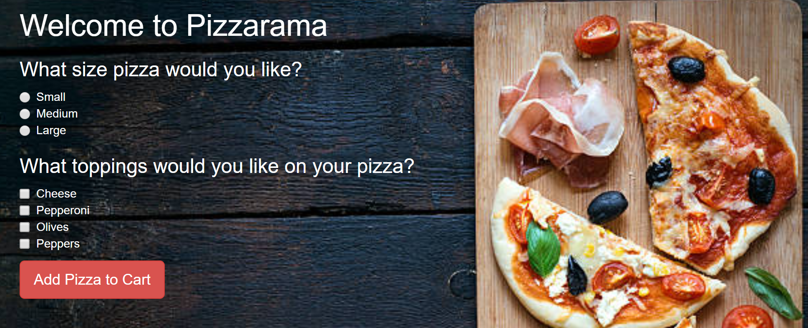

# _Pizzarama Pizza Delivery_

#### _This is a webpage application built using HTML, CSS, Bootstrap, JavaScript, and jQuery, which was built using the behavior-driven development process. It simulates the customization and ordering of a pizza from a fictional pizzeria, {June 29, 2018}_

#### By _**Mike B Lambert**_

## Setup/Installation Requirements

* _Clone this repository using "git clone."_
* _Open index.html in any browser._

## Support and contact details

_mlamb128@gmail.com_

## Technologies Used

_JavaScript, jQuery, HTML, CSS, and Bootstrap._

### License

*MIT License.*

Copyright (c) 2018 **_Mike B Lambert_**
